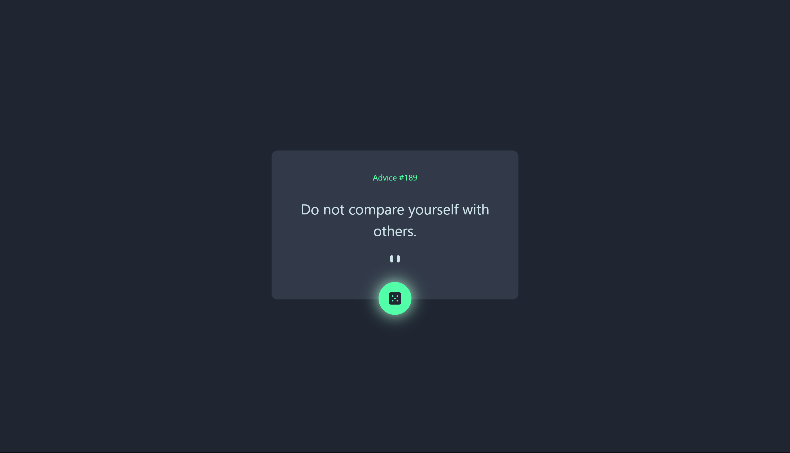

# Frontend Mentor - Advice generator app solution

This is a solution to the [Advice generator app challenge on Frontend Mentor](https://www.frontendmentor.io/challenges/advice-generator-app-QdUG-13db). Frontend Mentor challenges help you improve your coding skills by building realistic projects.

## Table of contents

- [Overview](#overview)
  - [The challenge](#the-challenge)
  - [Screenshot](#screenshot)
  - [Links](#links)
- [My process](#my-process)
  - [Built with](#built-with)
  - [What I learned](#what-i-learned)
  - [Continued development](#continued-development)
  - [Useful resources](#useful-resources)
- [Author](#author)
- [Acknowledgments](#acknowledgments)

**Note: Delete this note and update the table of contents based on what sections you keep.**

## Overview

### The challenge

Users should be able to:

- View the optimal layout for the app depending on their device's screen size
- See hover states for all interactive elements on the page
- Generate a new piece of advice by clicking the dice icon

### Screenshot

### Links

- Solution URL: [GitHub](https://github.com/rawrisotto/advice-generator)
- Live Site URL: [Netlify](https://your-live-site-url.com)

## My process

### Built with

- Semantic HTML5 markup
- Mobile-first workflow
- [React](https://react.dev/) - TypeScript
- [Tailwind CSS](https://tailwindcss.com/) - For styles
- [Axios](https://axios-http.com/docs/intro) - For API
- [Vite](https://vitejs.dev/) - For development environment

### What I learned

Got started with React + TS + Vite + Axios.

### Continued development

Need to learn more about react hooks, proper file management and axios.

### Useful resources

- [React Tutorial for Beginners](https://www.youtube.com/watch?v=SqcY0GlETPk) - This helped me got started with react and all the basic functionalities. Highly recommend any new beginners to watch his tutorials for getting started on react.

## Author

- GitHub - [GitHub](https://github.com/rawrisotto)
- Frontend Mentor - [@rawrisotto](https://www.frontendmentor.io/profile/rawrisotto)

## Acknowledgments

Would like to thank Mosh Hamedani [Code With Mosh](https://codewithmosh.com/) for providing a platform to learn not just react but programming languages and other frameworks as well.
